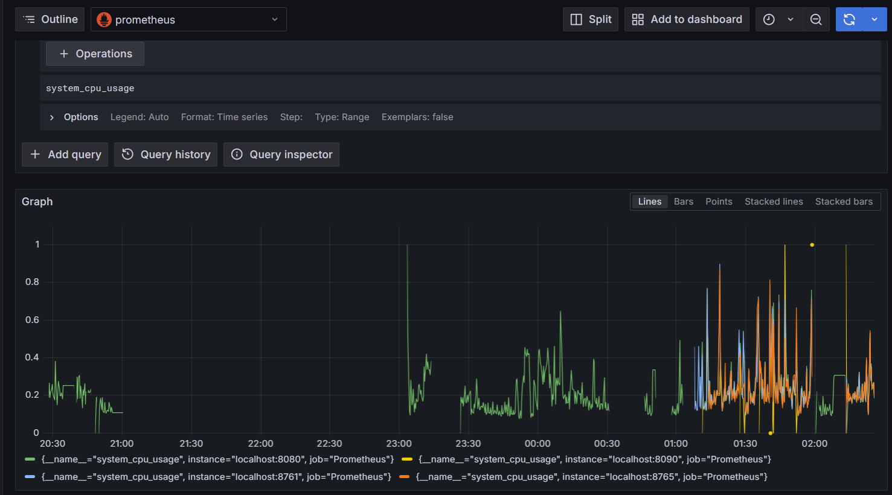
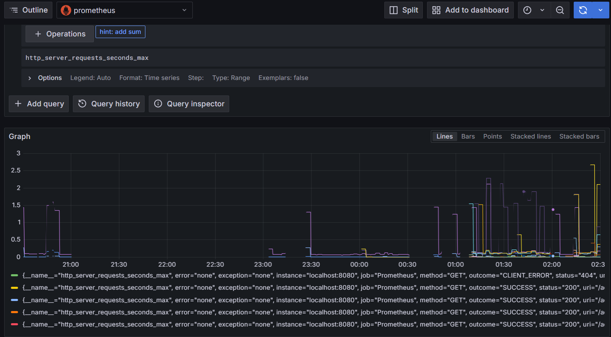
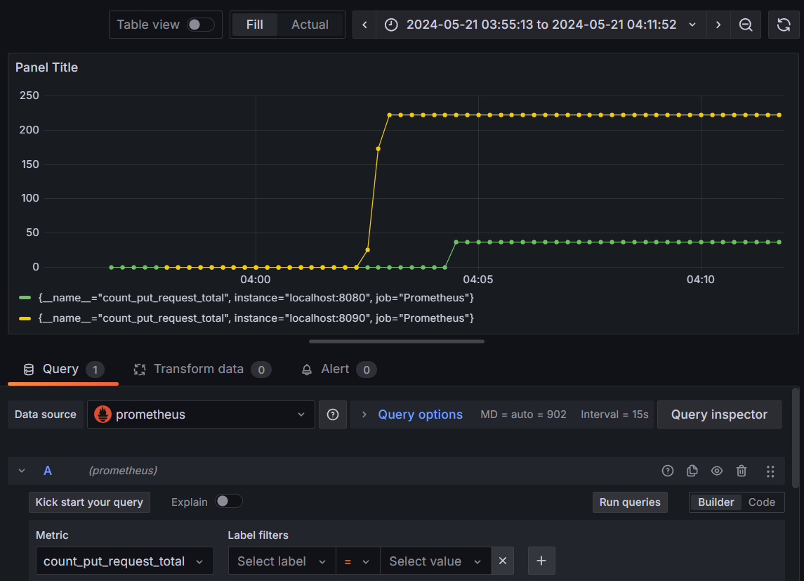
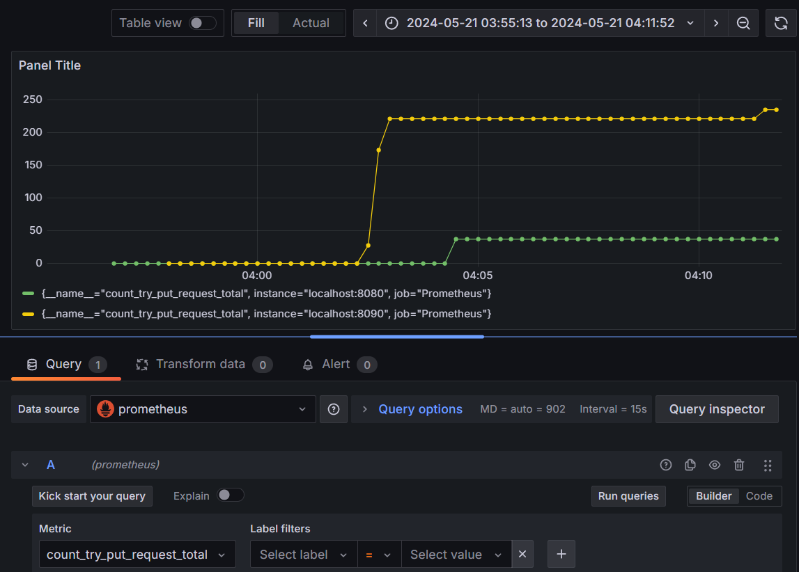

# О проекте
В данном проекте реализованы простые REST приложения для работы с БД магазина и склада.

Имеются метрики в том числе и свои с помощью io.micrometer и аспекты логирующие сам процесс выполнения (методы покупки продуктов и отправки продуктов с склада в машазин) и время выполнения методов.\
Проект содержит:
* configurationServer - сервер конфиграции (рекомендуеться запускать первым)
* eurekaMagNWare - Эврика Netflix сервер.
* GateWayMagNWare - API Gateway сервер.
* magazine - сервер для работы с БД магазина.
* warehouse - сервер для работы с БД склада.
## Содержание  
[MagazineController и MagazineControllerAdapter](#Magazine) 

[WarehouseController](#Warehouse)

[MetricsController](#MetricsController)  

[Логирование](#Logging)  

[Prometheus](#Prometheus)

[Нагрузочные тесты](#JMeter)  

[Метрики](#Metrics)  

<a name="Magazine"><h2>MagazineController и MagazineControllerAdapter</h2></a>
MagazineController - базовый REST контроллер для общения с магазином, обращение по ссылке "/magazineService".

Функции контроллера: 
* запрос GET, путь "/list" показывает все продукты, что имеются в магазине.
* запрос PUT, путь "/buyId/{id}/{sum}" купить продукт по id с указанием суммы оплаты. В качетве ответа вернет сдачу.
* запрос PUT, путь "/buy/{name}/{sum}" купить продукт по именм с указанием суммы оплаты. В качетве ответа вернет сдачу.
* запрос POST, путь "/add" добавить продукт в БД магазина. Объект передаеться по RequestBody.
MagazineControllerAdapter - улучшений REST контроллер для общения с магазином с функцией корзины и дополнительным методом получения информации о продукте по id, обращение по ссылке "/MS"./
Реализует все те же функции, что MagazineControlle.

Новые функции контроллера: 
* запрос GET, путь "/prod/{id}" получить информацию о продукте по id, что имеются в магазине.
* запрос PUT, путь "/addFromBasket/{name}" положить продукт в корзину по имени.
* запрос DELETE, путь "/delFromBasket/{name}" удалить продукт из корзины по имени.
* запрос GET, путь "/sumOfBasket" получить сумму покупок, что уже лежат в корзине.
* запрос GET, путь "/basketList" получить лист покупок, что уже лежат в корзине.
* запрос PUT, путь "/payBasket/{sum}" оплатить все покупки, что лежат в корзине. В качетве ответа вернет сдачу.
  
<a name="Warehouse"><h2>WarehouseController</h2></a>
WarehouseController - базовый REST контроллер для общения со складом, обращение по ссылке "/warehouseService".

Функции контроллера: 
* запрос GET, путь "/list" показывает все продукты, что имеются на складе.
* запрос GET, путь "/magReport" получить отсчет о содержании продуктов в магазине.
* запрос PUT, путь "/pushId/{id}" отправить продукт по id в магазин. В качетве ответа вернеться ответ от сервера magazine.
* запрос PUT, путь "/push/{name}" отправить продукт по имени в магазин. В качетве ответа вернеться ответ от сервера magazine.
* запрос POST, путь "/add" добавить продукт в БД склада. Объект передаеться по RequestBody.
  
<a name="MetricsController"><h2>MetricsController</h2></a>
Одинаков как для __magazine__, так и для __warehouse__ серверов. Обращение просходит по пути "/myMetrics".\
Данный REST контроллер возвращает такие метрики как:
* запрос GET, путь "/count_put" возращает количество выполненых PUT запросов.
* запрос GET, путь "/count_try_put" возращает количество попыток выполнения PUT запросов.
* запрос GET, путь "/process_time" время выполнения PUT запроса.
  
<a name="Logging"><h2>Логирование</h2></a>
Логи сохраняться в папке LOG на сервере в виде Markdown файлов. Логи с препиской Process хранять начальные данные данные выполнения запросов и их результат. Если преписка Time, то лог хранит время выполения всех запросов на сервере.\
Для логирования процессов выполнения запросов над методом требуеться поставить аннотации @ToRegistrStartMethod и @ToRegistrReturnMethod.

<a name="Prometheus"><h2>Prometheus</h2></a>
Файл prometheus.yml хранит конфигурацию для отслеживания метрик в том числе и тех, что предоставляет MetricsController.

<a name="JMeter"><h2>Нагрузочные тесты</h2></a>
* Тест для __magazine__ сервера храниться в файле MagazineTest.jmx.
* Тест для __warehouse__ сервера храниться в файле WarehouseTest.jmx.
В ходе проведения нагрузочного тестирования были выявлены деффекты в процессе оплаты, поэтому метод был изменен. 

  
<a name="Metrics"><h2>Метрики</h2></a>
### Общие

### Количесво успешных PUT запросов

### Количесво PUT запросов (включая неудачные)

### Максимальное время выполнения PUT запросов

### Суммарное время выполнения PUT запросов

