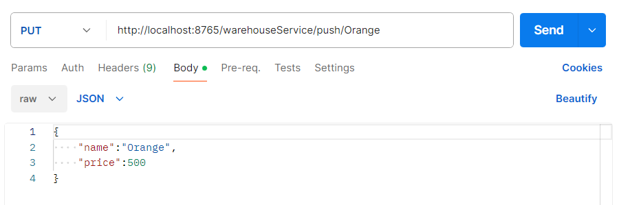
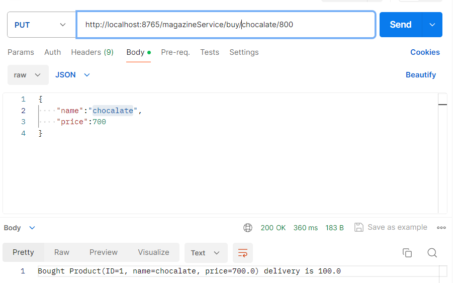
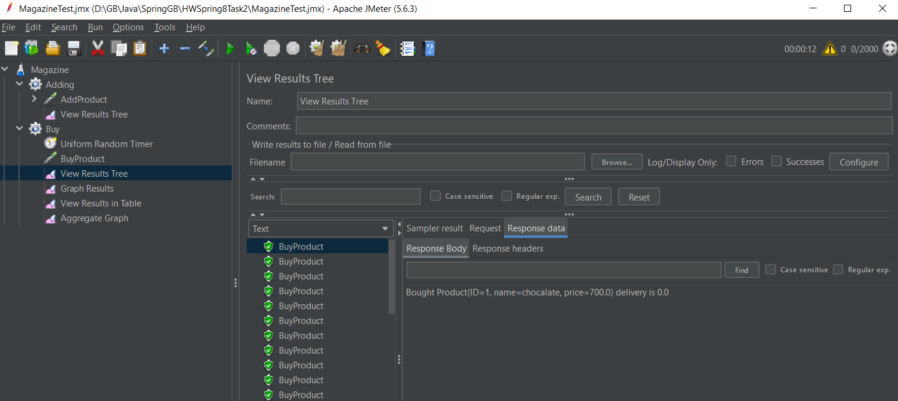

# Аспекты логгируют время и результат работы методов в MarkDown файлы в папку LOG
# В ходе проведения нагрузочного тестирования были выявлены деффекты в процессе оплаты, поэтому метод был изменен. 

